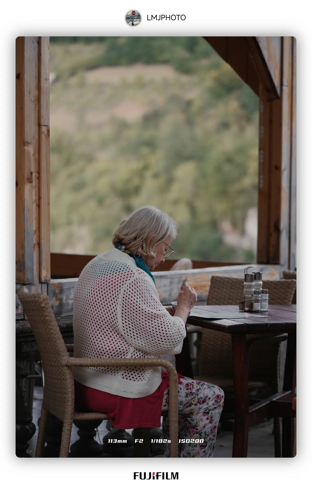
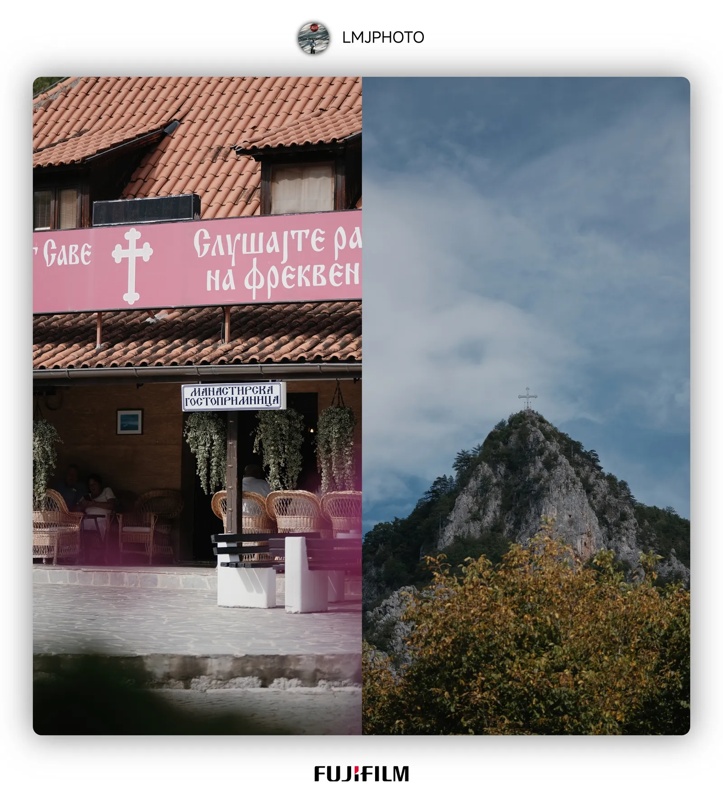
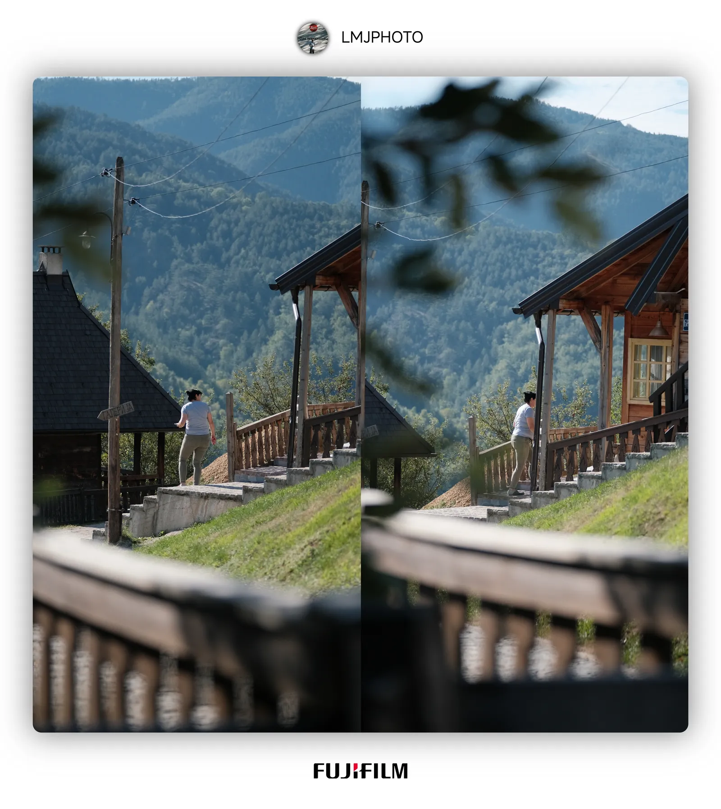
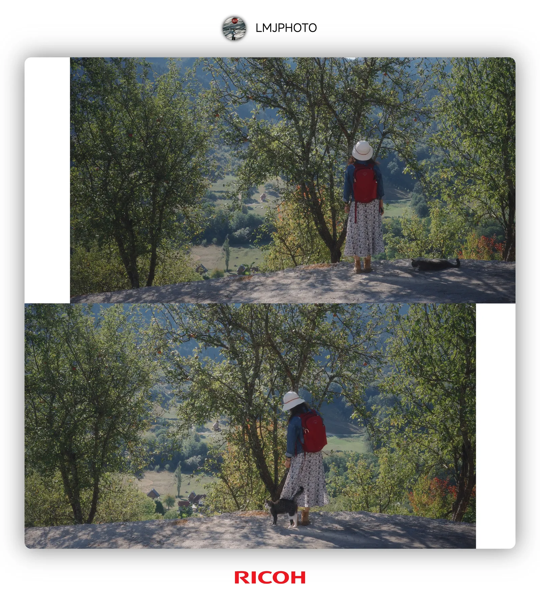
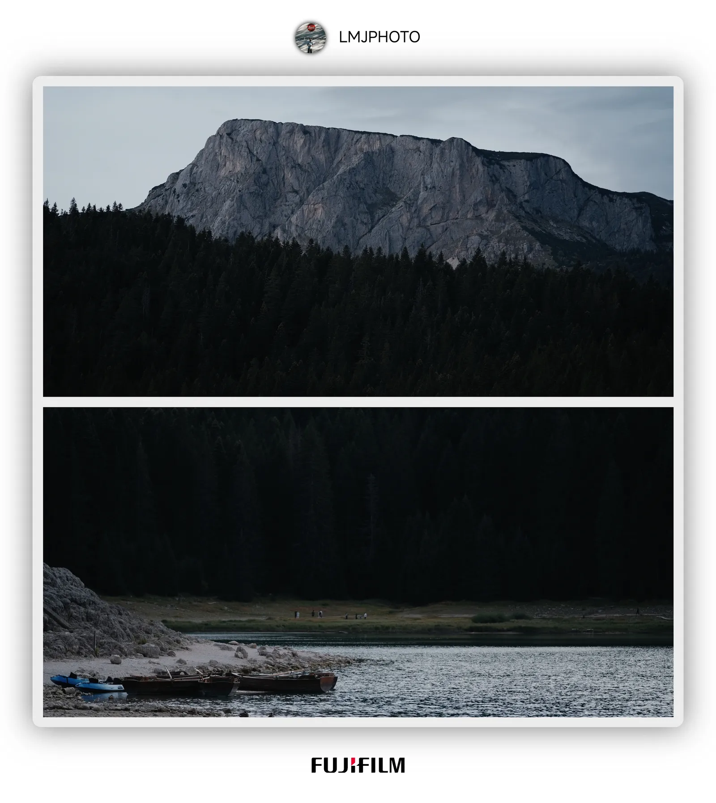
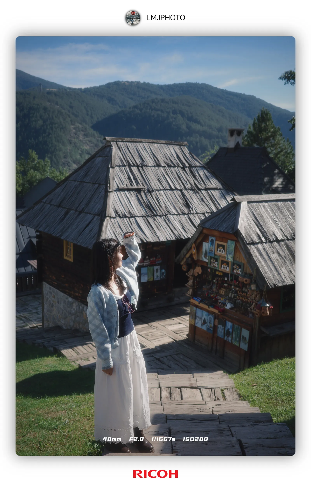
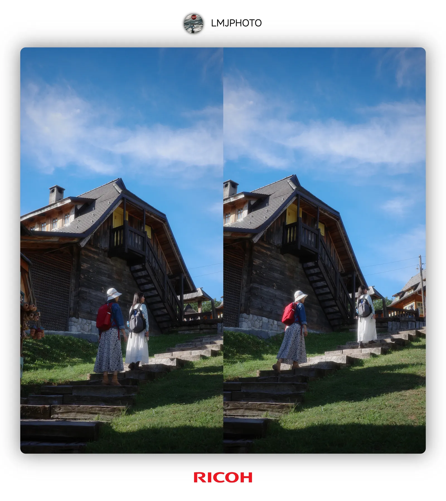
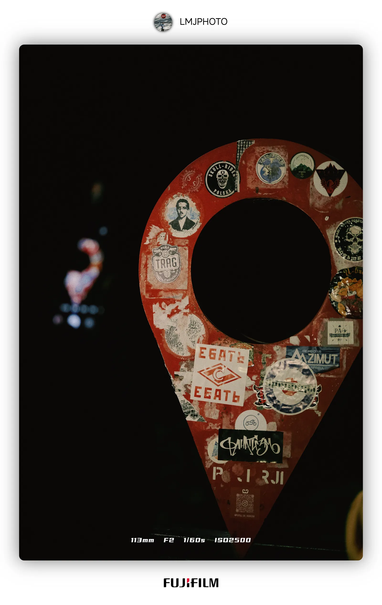

## 2025 European Travel Photography | Arriving on the Fifth Continent——Rediscovering the World Amidst the Fairytales and Tranquility of the Balkans - Image Gallery

 

 

 

 

 

 

 

 

 

 

 

 